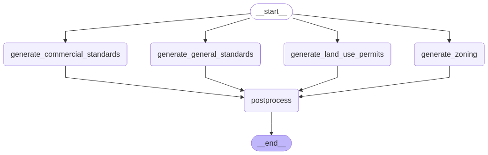

# Dynamic Document Generation Pipeline

## About the project

This project provides a streamlined pipeline for generating dynamic documents using FastAPI and Uvicorn. It allows users to submit data and receive generated documents through a simple API interface.​
Here’s an overview of the current LLM agent workflow:

<div align="center">
    <br>
    <br><br>
</div>

Note: You requested the `header_content` generator; however, this variable was not included in your `template.html`. To ensure consistency and proper functionality, I have updated it to use variables that align with those defined in your `template.html`.

## Installation

1. Install uv (if not already installed):

```bash
pip install uv
```

2. Set up the project environment:

```bash
uv venv
source .venv/bin/activate  # On Windows: .venv\Scripts\activate
uv sync
```

## Running the Application

1. Start the FastAPI server:
Ensure you're in the project directory and run:

```bash
uvicorn main:app --reload
```

2. Access the API documentation:
Open your browser and navigate to:

```
http://127.0.0.1:8000/docs
```

Here, you can interact with the API endpoints directly through the Swagger UI.

## Generating a Document

1. Send a POST request to the `/generate` endpoint:
ou can use tools like `curl`, `httpie`, or the `Swagger UI` at `/docs`.
Example using `curl`:

```bash
curl -X POST "http://127.0.0.1:8000/generate" \
     -H "Content-Type: application/json" \
     -d '{
           "request_id": "test-123",
           "data": {}
         }'
```

The code by default loads information from `static/dummy_data.json` file, and for the AI generation used Openai API key, so make sure to set them up properly. (change `api.cfg.example` to `api.cfg` with your own api_key.)

2. View the generated document:
After a successful generation, access the document at:

```
http://127.0.0.1:8000/view/test-123
```

## Running Tests

To run the test suite using `pytest`:

```bash
pytest -v tests/test_agents.py
```
